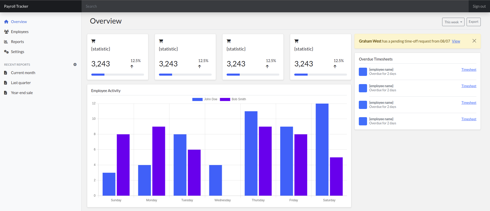
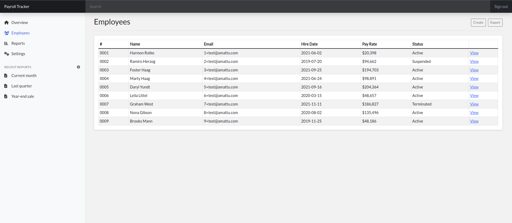
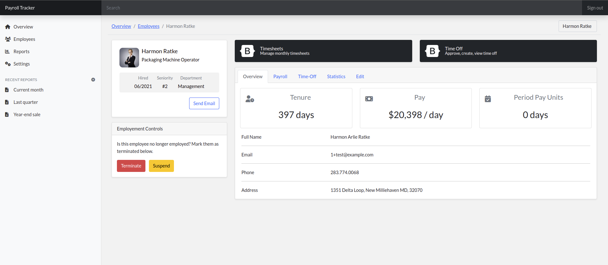
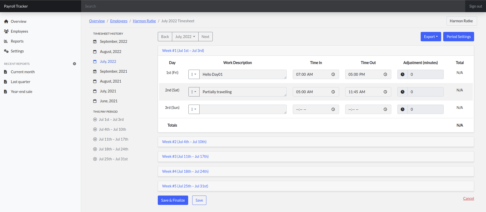
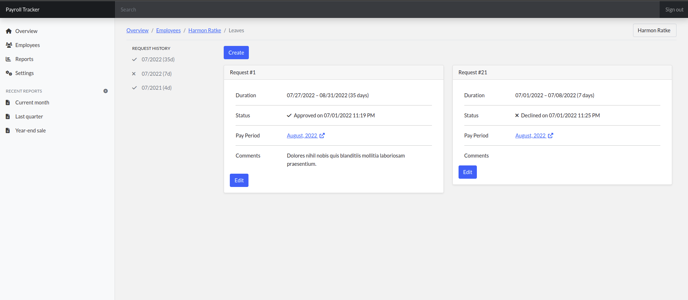

# Introduction

A comprehensive HR employee management and timekeeping system. Digitize timesheets, handle time-off requests, and automate standard onboarding procedures.

Abbreviated list of functionality:

- Employee management
- Linked employee accounts
- Track clock-in/clock-out times
- Finalize timesheets with automated notifications
- Manage leave/time-off requests

Coming Soon:

- Automate onboarding procedures with push notifications of hired/terminated employees
- Pre-built reports and employee insights
- Company/department closures and scheduling with notifications
- Supervisor/Department tracking

# Getting Started

Install both Composer and NPM dependencies.

```bash
composer install
npm install
```

Create a copy of the `.env.example` file and rename it to `.env`. Update the database credentials and application key.

```bash
cp .env.example .env
```

Run the database migrations and seeder.

```bash
php artisan migrate --seed
php artisan run:factories # Optional: Seed the database with dummy data
php artisan cache:clear # Clear the temporary DB cache
```

Build frontend the assets

```bash
npm run dev
```

Run the backend service

```bash
php artisan serve
```

Open your browser and navigate to [http://localhost:8000](http://localhost:8000). You can log in with the following credentials (default):

- Email: `admin@example.com`
- Password: `password`

# Previews

## Overview Page



## Employees Page





## Timesheets



## Leave/PTO Page



# Requirements & Dependencies

- PHP 8+
- Laravel 9.X+
- MySQL
- Bootstrap 5.X+
